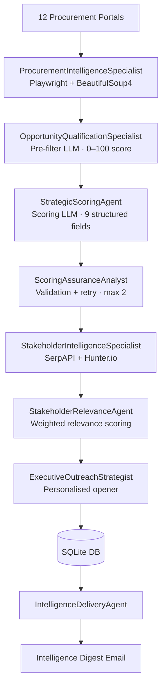

# Agentic Workflow Orchestrator

> A production-style agentic workflow platform for procurement intelligence. Discovers opportunities across 12 fragmented public portals, filters and scores them through a 7-agent pipeline, enriches them with stakeholder contacts, and delivers a ranked intelligence digest — fully automated, twice weekly.


---

## What It Does

Government procurement portals publish hundreds of RFPs per week across fragmented sources with no unified API. Manual review is inconsistent, time-consuming, and misses opportunities that don't match obvious keywords. This platform automates the full intelligence cycle:

1. **Discovers** — scrapes 12 Canadian and US government procurement portals twice weekly
2. **Scores** — runs a two-phase LLM scoring pipeline against a configurable capability profile
3. **Enriches** — discovers and validates decision-maker contacts at each issuing organization
4. **Delivers** — produces a ranked Intelligence Digest with scored opportunities and personalised outreach openers every Monday morning

---

## Architecture



### Design Principles

- Fail-safe over fail-fast
- Config over hardcoding
- Sequential clarity over parallel complexity
- Cost-aware AI orchestration

---

## Key Technical Decisions

| Decision | Rationale |
|---|---|
| **Sequential pipeline** | Enables reliable per-agent `signal.alarm` timeouts; eliminates shared mutable state; async is incompatible with Playwright C-extensions. [ADR-001](docs/architecture/adr-001-sequential-pipeline.md) |
| **SQLite + artifact pattern** | Zero infrastructure cost; DB file is portable and auditable; dedup via URL unique constraint. [ADR-002](docs/architecture/adr-002-sqlite-artifact-pattern.md) |
| **Two-phase LLM scoring** | Fast pre-filter drops ~80% of listings before the expensive deep-score model runs, reducing per-run LLM cost by 75–85%. [ADR-003](docs/architecture/adr-003-two-phase-llm-scoring.md) |
| **Configurable capability profile** | Swap `CLIENT_NAME`, `CLIENT_DESCRIPTION`, and `docs/data/capability-profile.md` to deploy for any organization without code changes |

---

## Key Capabilities

| Capability | Implementation |
|---|---|
| **12 procurement portals** | MERX, BidNet, RFPMart, CanadaBuys, BidsCanada, BidsAndTenders, BCBid, CanadaTenders, SaskTenders, AlbertaPurchasing, TorontoBids, MetroVancouver |
| **Two-phase AI scoring** | Pre-filter LLM (0–100 score) + deep-score LLM (9 structured fields + 7-component priority score) |
| **Contact discovery** | SerpAPI org search + Hunter.io email verification |
| **Contact relevance scoring** | 4-component weighted model: seniority 40%, domain 35%, engagement signals 15%, org proximity 10% |
| **Personalised outreach** | LLM-generated 2-sentence email opener per contact, tuned to opportunity and contact role |
| **Score drift detection** | 10-case golden calibration set; `ScoringAssuranceAnalyst` validates against it per run |
| **Full observability** | Every agent phase logs to `pipeline_runs` SQLite table: agent, start/end time, items in/out, status |
| **Per-agent timeout** | `signal.alarm(30)` per agent; failures log to `state['errors']` and skip — pipeline never hard-stops |

---

## Impact

- Reduced manual procurement analysis effort by 5–10 hours per week
- Improved opportunity signal-to-noise ratio from ~1:40 to ~1:5
- Standardised evaluation across inconsistent public sector data sources
- Enabled repeatable, auditable business development workflows with zero manual trigger

---

## Tradeoffs

- Sequential execution increases total runtime (~8–12 min per run) but maximises reliability and debuggability
- SQLite artifact pattern limits write concurrency but eliminates infrastructure overhead entirely
- Two-phase scoring introduces recall risk below threshold, mitigated via configurable `FILTER_THRESHOLD`

---

## Extensibility

- Swap the capability profile to deploy across any industry or organisation — no code changes required
- Replace the LLM provider by updating model configuration; the prompt contracts are provider-agnostic
- Add or remove execution agents without breaking the orchestration contract — each agent is independently testable

---

## Tech Stack

| Layer | Technology |
|---|---|
| Language | Python 3.11+ |
| Web scraping | Playwright (Chromium), camoufox (Firefox stealth), Requests + BeautifulSoup4 |
| AI scoring | Anthropic API (configurable) |
| Contact discovery | SerpAPI, Hunter.io |
| Email delivery | Resend API |
| Database | SQLite (local + GitHub Actions artifact) |
| Scheduling | GitHub Actions (cron) |
| Testing | pytest (197 tests, fixture-only, no live API calls) |

---

## Quick Start

### Prerequisites

- Python 3.11+
- API keys: Anthropic, SerpAPI, Hunter.io, Resend

### Setup

```bash
git clone https://github.com/nammnjoshii/Agentic-Workflow-Orchestrator
cd Agentic-Workflow-Orchestrator
pip install -r requirements.txt
cp .env.example .env
# Set CLIENT_NAME, CLIENT_DESCRIPTION, and API keys in .env
```

### Configure for Your Organisation

1. Set `CLIENT_NAME` and `CLIENT_DESCRIPTION` in `.env`
2. Update `docs/data/capability-profile.md` with your capabilities and disqualifiers
3. Update `docs/client-briefing.md` with your competitive context

### Run Demo (No API Calls)

```bash
PYTHONPATH=. DRY_RUN=true python examples/demo_run.py
```

### Run Tests

```bash
PYTHONPATH=. DRY_RUN=true python3 -m pytest tests/ -v
```

### Run Full Pipeline

```bash
python main.py scrape
```

### Send Intelligence Digest

```bash
python main.py digest
```

---

## Automated Scheduling

| Workflow | Schedule | Action |
|---|---|---|
| `daily_scrape.yml` | Mon + Thu, 7 AM PT | Full 7-agent pipeline; uploads DB artifact |
| `weekly_digest.yml` | Mon, 8 AM PT | Downloads artifact; sends Intelligence Digest |

Configure via GitHub Actions Secrets — see [docs/infrastructure/environment.md](docs/infrastructure/environment.md).

---

## Project Documentation

| Document | Purpose |
|---|---|
| [System Design](docs/architecture/system-design.md) | End-to-end architecture, data flow, failure model |
| [Operating Model](docs/architecture/operating-model.md) | Execution cadence, observability, intervention points |
| [ADR-001: Sequential Pipeline](docs/architecture/adr-001-sequential-pipeline.md) | Why sequential over async |
| [ADR-002: SQLite Artifact Pattern](docs/architecture/adr-002-sqlite-artifact-pattern.md) | Why SQLite over hosted DB |
| [ADR-003: Two-Phase LLM Scoring](docs/architecture/adr-003-two-phase-llm-scoring.md) | Cost/quality optimisation strategy |
| [Capability Profile](docs/data/capability-profile.md) | Configure scoring for your organisation |
| [Testing Strategy](docs/quality/testing-strategy.md) | 197-test design, calibration, drift detection |
| [Cost Model](docs/infrastructure/cost.md) | Per-run LLM cost breakdown |
| [Antipatterns](docs/operation/antipatterns.md) | Hard constraints and why they exist |

---

## Testing

197 tests covering all execution agents, database operations, pipeline integration, contact validation, and scoring logic. All tests use fixtures — no live API calls.

```bash
PYTHONPATH=. DRY_RUN=true python3 -m pytest tests/ -v
```

---

## License

MIT — see [LICENSE](LICENSE).
